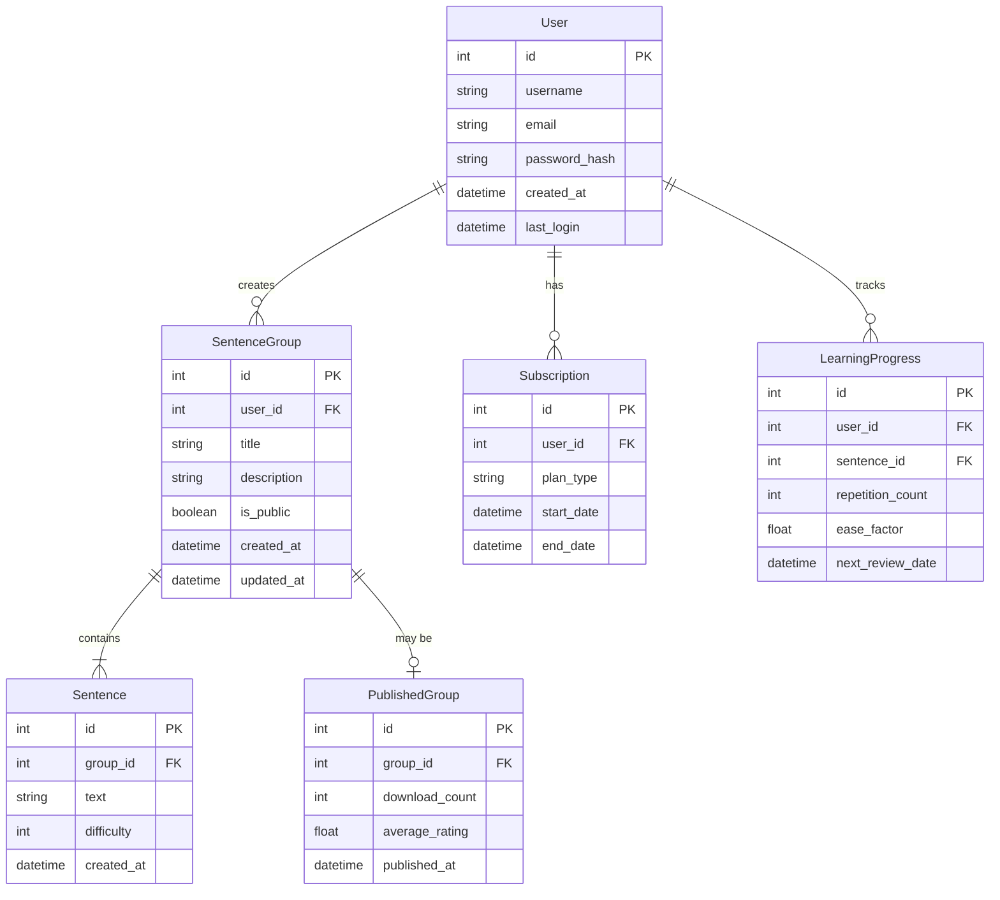

```mermaid
erDiagram
    User ||--o{ SentenceGroup : creates
    User ||--o{ Subscription : has
    SentenceGroup ||--|{ Sentence : contains
    SentenceGroup ||--o| PublishedGroup : "may be"
    User ||--o{ LearningProgress : tracks

    User {
        int id PK
        string username
        string email
        string password_hash
        datetime created_at
        datetime last_login
    }

    Subscription {
        int id PK
        int user_id FK
        string plan_type
        datetime start_date
        datetime end_date
    }

    SentenceGroup {
        int id PK
        int user_id FK
        string title
        string description
        boolean is_public
        datetime created_at
        datetime updated_at
    }

    Sentence {
        int id PK
        int group_id FK
        string text
        int difficulty
        datetime created_at
    }

    PublishedGroup {
        int id PK
        int group_id FK
        int download_count
        float average_rating
        datetime published_at
    }

    LearningProgress {
        int id PK
        int user_id FK
        int sentence_id FK
        int repetition_count
        float ease_factor
        datetime next_review_date
    }
```