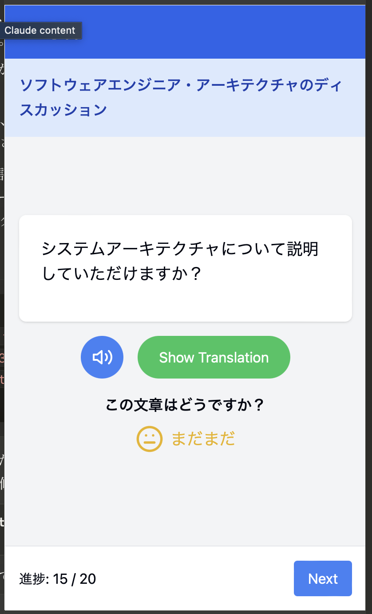
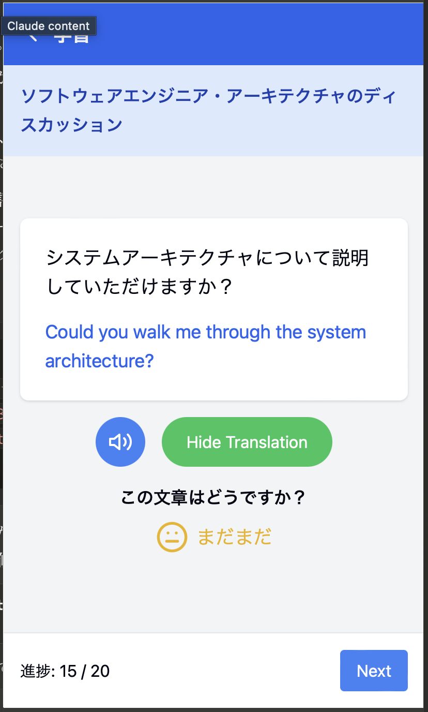

# Flash-Learner: 仕事のための言語学習者向け瞬間英作文プラットフォーム

## モチベーション
- 自分が使いたいアプリケーションを作りたい
- 自分（等）のプロダクトを作ってみたい・運用してみたい

## 想定ターゲット
- ビジネスパーソン（特にIT業界）
    - 運営側がユーザをイメージしやすい、ターゲット＝自分
    - 英語はツール、と割り切り、特定のビジネスシーンに特化して学習したい人は絶対にいる
- 日本語学習に意欲的な外国人
  - ターゲットの規模を広げたい
  - 例文のテーマ設定（漫画、東京観光など）次第では、特定の日本ファンに刺さるものが作れそう
- 語学学習を始めたばかりのライト層
  - ターゲットの規模を広げたい
  - 英語だけではなく、他の言語に対応したい

使ってもらえそうな層に特化したアプリケーションにしたい

## アプリの概要

Flash-Learnerは、瞬間英作文を通じて効果的な言語学習を実現するモバイルアプリケーションです。
学習コンテンツは、運営側が用意した例文に加え、ユーザーが独自に登録することができます。また、ユーザが指定したテーマに基づいてLLM（大規模言語モデル）が自動生成することもできます。

運営は、特定の職業（ソフトウェアエンジニア、ITコンサルタント、プロジェクトマネージャーなど）や場面に特化した例文を用意します。例えば、「ソフトウェアエンジニア・アーキテクチャのディスカッション」や「モバイルアプリケーションエンジニア・採用面談」といった具体的なシチュエーションに対応した学習が可能です。

ユーザーの学習意欲を高めるための機能も実装されています。

各例文に対する理解度（習熟度）を星の数で表現します。習熟度の判定はユーザー自身が行いますが、将来的にはLLMによる自動判定機能の実装も検討しています。

習熟判定時には「頑張ったね」「最高」「超かっこいい」「素敵」などの音声が再生されます。この音声は女性、男性、ギャル、ジムトレーナーから選択でき、ユーザーの好みに合わせてON/OFFの切り替えも可能です。

また、連続学習日数の記録が自動で登録されます。ユーザーは自分の学習記録を画像としてXにシェアすることができます。

## 課金モデル
### 1. 機能限定版：無料
- 運用側が用意した例文3つ
- ユーザが登録できる例文セット20個

### 2. 全機能解放版：月額¥500 or 年額¥5,000
  - 無制限の例文セットの作成
  - AI文章生成機能（1日60文まで）
  - 音声生成・再生機能

## 機能一覧
1. **ユーザー管理**
- アカウント作成・ログイン（Google/Apple ID連携）
- プロフィール管理

2. **例文グループ管理**
- 例文グループの作成・編集・削除
- 文章の追加・編集・削除
- システム提供の例文グループの使用

3. **学習機能**
- フラッシュカード形式の復習
- 音声読み上げ

4. **AI文章生成**
- コンテキストに基づいた関連文章の自動生成
- 難易度調整機能

5. **コミュニティ機能**
- グループの公開・共有
- 人気例文グループのランキング

6. **進捗管理・分析**
- 学習統計・グラフ表示
- 目標設定・達成度トラッキング

7. **カスタマイズ**
- 音声変更
  - 女性
  - 男性
  - ギャル
  - ジムトレーナー
- 学習リマインダー設定
  - PUSH通知

8. **多言語サポート**
- 複数言語のインターフェース
- 複数言語の学習コンテンツ

## 画面イメージ
瞬間英作文フラッシュカード画面

翻訳表示

## 画面遷移図
[screen.md](screens.md)

## データモデル（ER図）
[datamodel.mdk](datamodel.md)