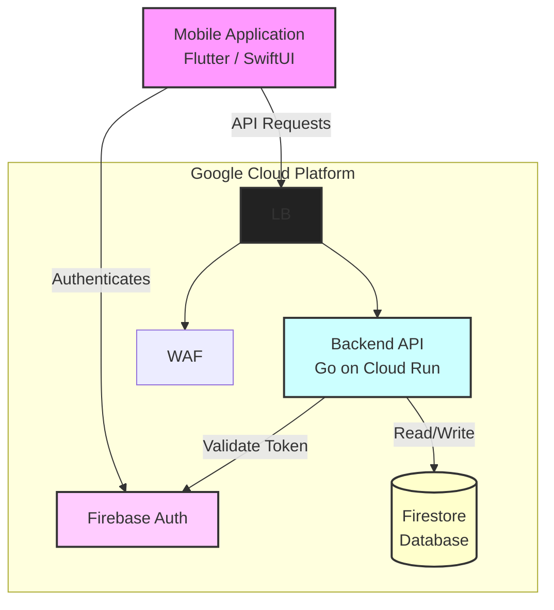

- Mobile Application
  - 主に画面描画, APIリクエストを行う
- LB
  - WAF（Cloud Armor）のため
- CloudRun
  - APIサーバ
- Firestore
  - ユーザごとにコレクションを作成

```mermaid
graph TD
    A[Mobile Application<br>Flutter / SwiftUI] -->|Authenticates| B[Firebase Auth]
    A -->|API Requests| E[LB]
    E --> C[Backend API<br>Go on Cloud Run]
    C -->|Read/Write| D[(Firestore<br>Database)]
    C -->|Validate Token| B
    E --> W[WAF]

    subgraph Google Cloud Platform
    B
    E
    C
    D
    W
    end

    style A fill:#f9f,stroke:#333,stroke-width:2px
    style B fill:#fcf,stroke:#333,stroke-width:2px
    style C fill:#cff,stroke:#333,stroke-width:2px
    style D fill:#ffc,stroke:#333,stroke-width:2px
    style E fill:#222,stroke:#333,stroke-width:2px

```