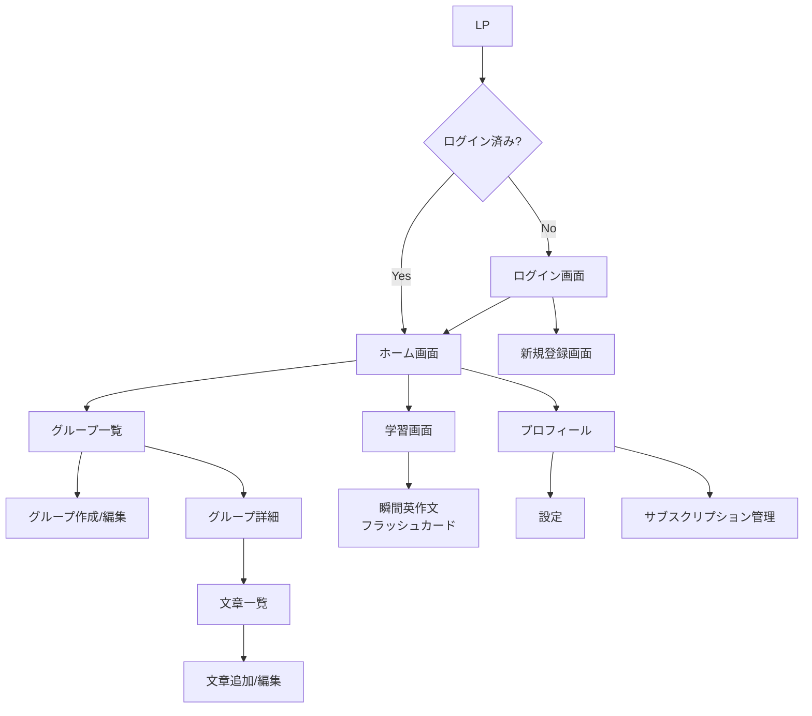

```mermaid
graph TD
    A[LP] --> B{ログイン済み?}
    B -->|Yes| C[ホーム画面]
    B -->|No| D[ログイン画面]
    D --> E[新規登録画面]
    D --> C
    C --> F[グループ一覧]
    C --> G[学習画面]
    C --> H[プロフィール]
    F --> I[グループ作成/編集]
    F --> J[グループ詳細]
    J --> K[文章一覧]
    K --> L[文章追加/編集]
    G --> M[瞬間英作文
    フラッシュカード]
    H --> O[設定]
    H --> P[サブスクリプション管理]
```